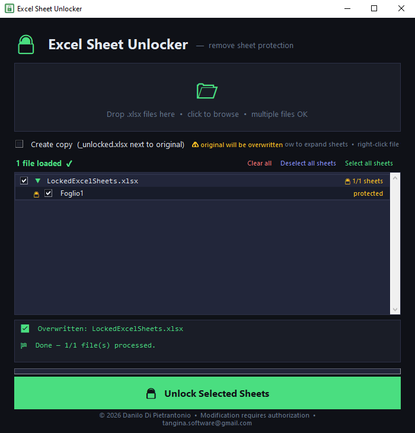

# 🔓 Excel Sheet Unlocker

Unlock protected Excel sheets with one click — saves a clean copy or overwrites the original.

> **No Python required:** grab the latest standalone `.exe` from [Releases](../../releases).

---

## Screenshot



---

## Features

- 📂 **Drag & drop** or browse for `.xlsx` files
- 🔍 **Scans** all sheets and shows which ones are protected
- ☑️ **Select individual sheets** to unlock — leave others protected
- 📋 **Batch processing** — handle multiple files at once
- 💾 **Copy or overwrite** mode — saves an `_unlocked.xlsx` copy or modifies in place
- 🔒 **Zip Slip protection** — safe handling of all archive operations
- 🖥️ Clean dark UI, no installation required (standalone `.exe` available)

---

## Requirements

- Python 3.8+
- [`tkinterdnd2`](https://pypi.org/project/tkinterdnd2/) *(optional — enables drag & drop)*

Install the optional dependency:

```bash
pip install tkinterdnd2
```

---

## Run from source

```bash
python excel_sheet_unlocker.py
```

---

## Build standalone `.exe` (Windows)

Requires [PyInstaller](https://pyinstaller.org/):

```bash
pip install pyinstaller
pyinstaller excel_sheet_unlocker.spec
```

The output will be in the `dist/` folder.

---

## How it works

Excel `.xlsx` files are ZIP archives. Sheet protection is stored as a `<sheetProtection>` XML tag inside each worksheet file. This tool extracts the archive, removes that tag from the selected sheets, and repackages the file — no password cracking.

---

## Known Limitations

- **Workbook-level protection is not removed.** This tool only strips `<sheetProtection>` tags, which lock individual sheets. A separate `<workbookProtection>` tag — common in macro-enabled `.xlsm` files — controls workbook structure (preventing sheet reordering, insertion, or deletion) and is left untouched. If your file has workbook protection, the sheets will be unlocked but the workbook structure lock will remain.

- **Password-encrypted files are not supported.** Files that are fully encrypted (where Excel prompts for a password just to *open* the file) cannot be processed — they are not standard ZIP archives.

---

## License

Custom non-commercial license — see [LICENSE.txt](LICENSE.txt).  
Free to use and share. Commercial use and redistribution of modified versions require written authorization.

---

## Contributing

Contributions are welcome! Please read [CONTRIBUTING.md](CONTRIBUTING.md) before opening a Pull Request.

---

## Author

**Danilo Di Pietrantonio** ([@devildanilo](https://github.com/devildanilo)) — tangina.software@gmail.com


[](https://ko-fi.com/devildanilo)